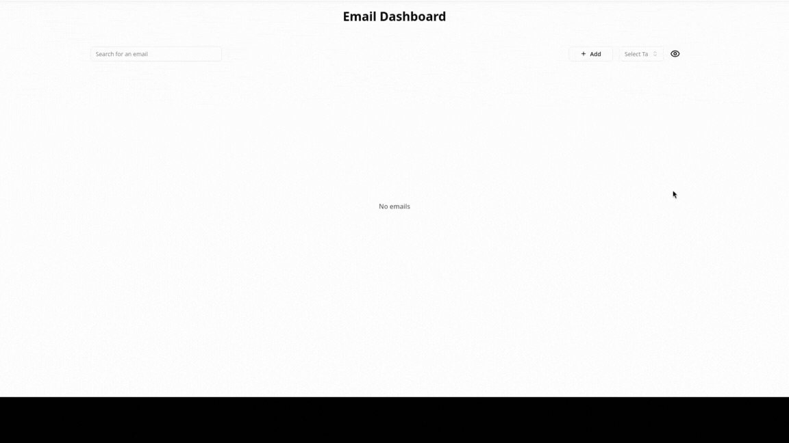

# tag-based Email Manager

Tag-based email manager for quick organization and retrieval. Built with React + Vite frontend, Express backend, and PostgreSQL database.

## Demo



## Quick Start

### Prerequisites

Ensure you have the following installed on your system:

- Docker
- Docker Compose

### Installation

```bash
git clone https://github.com/0x0bito/email-tagger
cd email-tagger
docker-compose up --build
```

### Access

- **Frontend**: http://localhost:8080
- **Backend API**: http://localhost:3333

## Project Structure

```
minimal-email-manager/
├── frontend/              # React + Vite app
│   ├── src/
│   ├── Dockerfile
│   └── ...
├── backend/               # Express API
│   ├── src/
│   ├── Dockerfile
│   └── ...
└── docker-compose.yml     # Container orchestration
```

## API Endpoints

The backend provides the following REST endpoints:

- `GET /api/emails` - Get emails

- `POST /api/emails` - Create email

- `GET /api/emails/:id` - Get email by ID

- `GET /api/emails/search/:email` - Get email by email

- `PUT /api/emails/:id` - Update email

- `DELETE /api/emails/:id` - Delete email

- `GET /api/emails/search?tags=tag1,tag2` - Search by tags
